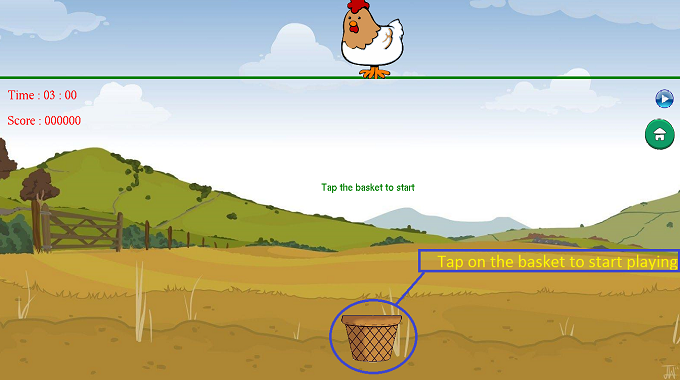
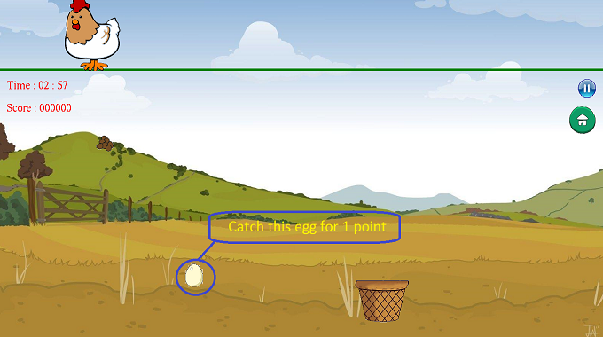
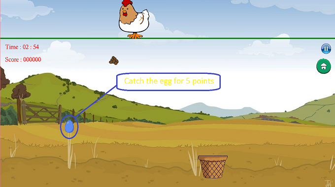
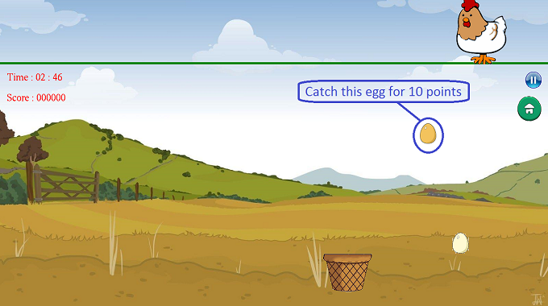
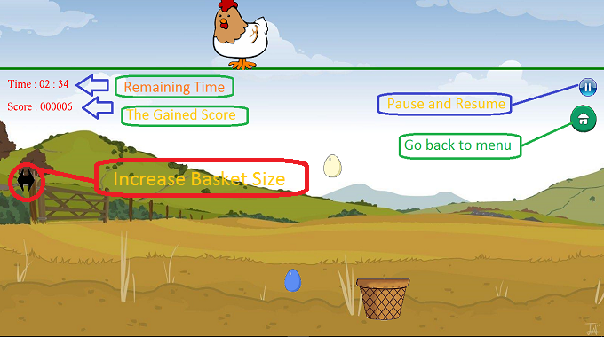
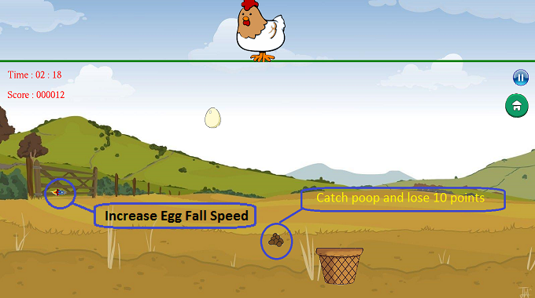
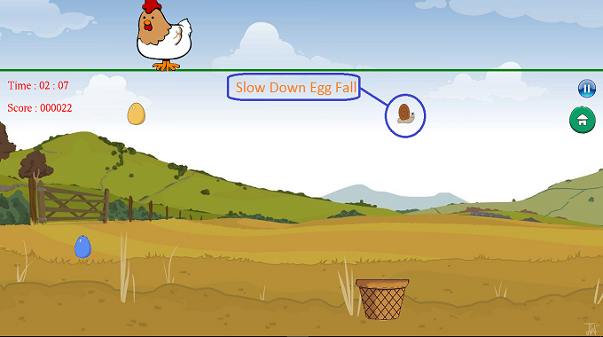
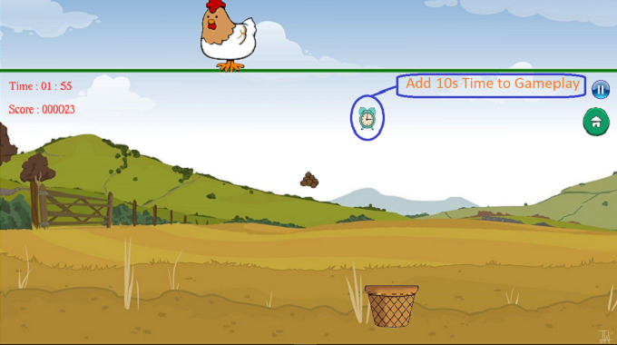
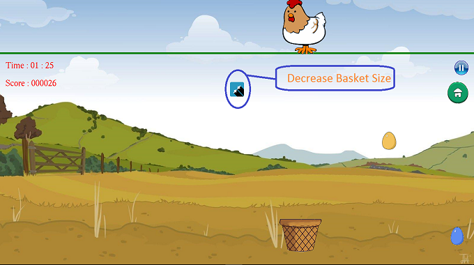

## **Catch the Egg | Term Project | BUET | L1T1**

A fun and interactive desktop game where a chicken sits on a bamboo stick, laying different types of eggs — golden (10 pts), blue (5 pts), and normal (1 pt) — along with occasional droppings you must avoid! The player controls a basket (via keyboard or mouse) to catch eggs and score as many points as possible within a chosen time limit.

This version includes:

* Adjustable difficulty levels (Easy, Medium, Hard)
* Realistic **airflow effect** influencing egg fall direction
* **Multiple eggs** dropped simultaneously for added challenge
* **Sound effects** for a more engaging experience
* A menu system with start, resume, high score, and exit options

Your goal: catch the most eggs, dodge the poop, and beat the clock!

### Catch the Egg Project Screenshots

<table>
  <tr>
    <td></td>
    <td></td>
    <td></td>
  </tr>
  <tr>
    <td></td>
    <td></td>
    <td></td>
  </tr>
  <tr>
    <td></td>
    <td></td>
    <td></td>
  </tr>
</table>
